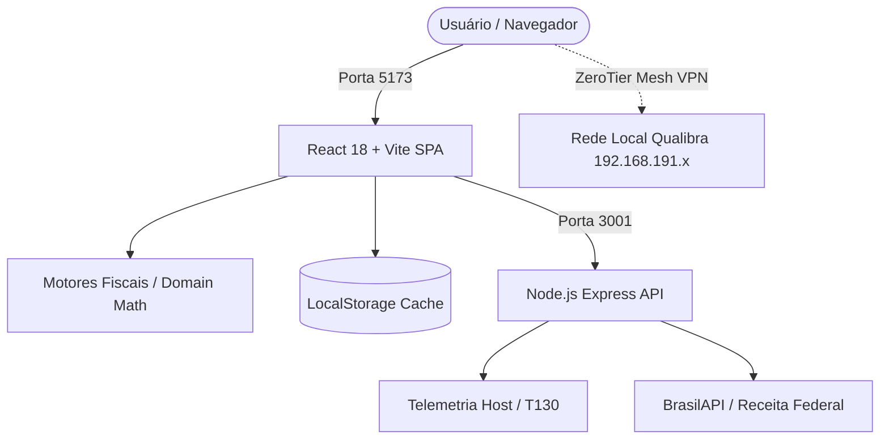

# 🏛️ Grupo Qualibra — Portal Operacional de Ferramentas & Rotinas (v3.0)

<p align="center">
  
  
  
  
  
</p>

<p align="center">
  <strong>Hub Corporativo Unificado de Cálculos Fiscais, Inteligência Tributária, Rotinas de Departamento Pessoal e Gestão Operacional.</strong>
  <br />
  Projetado para eliminar retrabalho, blindar a conformidade jurídica perante a RFB/eSocial e acelerar a tomada de decisão executiva.
</p>

---

## 📑 Sumário

- [Visão Geral & Arquitetura](#-visão-geral--arquitetura)
- [Matriz de Inteligência Legal & Módulos](#-matriz-de-inteligência-legal--módulos)
  - [1. Simulador da Reforma Tributária (LC 214/2025 & LC 215/2025)](#1-simulador-da-reforma-tributária-lc-2142025--lc-2152025)
  - [2. Análise Estratégica do Fator R (LC 123/2006)](#2-análise-estratégica-do-fator-r-lc-1232006)
  - [3. Simples Nacional vs. Lucro Presumido](#3-simples-nacional-vs-lucro-presumido)
  - [4. Simulador Rescisório CLT (Padrão eSocial/DCTFWeb)](#4-simulador-rescisório-clt-padrão-esocialdctfweb)
  - [5. Pró-Labore x Distribuição Isenta de Lucros](#5-pró-labore-x-distribuição-isenta-de-lucros)
  - [6. Comparador Corporativo CLT vs. PJ](#6-comparador-corporativo-clt-vs-pj)
  - [7. Diagnóstico Tributário & Auditoria de GAP](#7-diagnóstico-tributário--auditoria-de-gap)
  - [8. Gerador Estruturado de Termos e Recibos](#8-gerador-estruturado-de-termos-e-recibos)
  - [9. Calendário Fiscal Dinâmico (2026)](#9-calendário-fiscal-dinâmico-2026)
  - [10. TI, Conectividade & Mapeamento SMB](#10-ti-conectividade--mapeamento-smb)
  - [11. Canal de Inovação & Ideias](#11-canal-de-inovação--ideias)
- [Estrutura de Diretórios](#-estrutura-de-diretórios)
- [Instalação & Execução Local](#-instalação--execução-local)
- [Deploy Corporativo no Dell PowerEdge T130](#-deploy-corporativo-no-dell-poweredge-t130)
- [Acesso Remoto via ZeroTier (Home Office)](#-acesso-remoto-via-zerotier-home-office)
- [Padrões de Interface (UI/UX) & Impressão (@media print)](#-padrões-de-interface-uiux--impressão-media-print)
- [Segurança & Boas Práticas](#-segurança--boas-práticas)

---

## 🔭 Visão Geral & Arquitetura

O **Portal Grupo Qualibra** foi construído com separação estrita de responsabilidades:
1. **Frontend Desacoplado**: Single Page Application (SPA) em **React 18** e **Vite 5**, com estilização em **Tailwind CSS 3** utilizando o tema *Clean Executive Glassmorphism*. Cálculos em tempo de execução a **0ms** com tolerância zero a erros de arredondamento.
2. **Camada de Domínio Puro (`/src/domain`)**: Motores matemáticos isolados de frameworks visuais, permitindo auditoria tributária independente.
3. **Backend Proxy (`/Backend`)**: Microsserviço leve em **Node.js/Express** para contornar restrições de CORS ao consumir APIs públicas governamentais (BrasilAPI, Receita Federal) e expor telemetria da máquina host.



---

## ⚖️ Matriz de Inteligência Legal & Módulos

### 1. Simulador da Reforma Tributária (LC 214/2025 & LC 215/2025)
- **Cronograma Real de Transição**:
  - **2026**: Ano-teste experimental. Alíquota de 0,9% (CBS) + 0,1% (IBS) = 1,0% integralmente compensável/ressarcível.
  - **2027**: Extinção de PIS e COFINS com fixação definitiva da CBS em 8,8%.
  - **2028**: CBS em 8,8% + teste do IBS a 0,1%.
  - **2029–2032**: Escala decenal com redução gradual de ICMS/ISS à razão de 1/10 ao ano e substituição pelo IBS.
  - **2033**: Alíquota plena unificada (~26,5%).
- **Segregação do DAS**: Expurgos automáticos das frações de PIS, COFINS, ICMS e ISS por faixa de faturamento da LC 123/2006.
- **Não-Cumulatividade Plena**:
  $$\text{CBS/IBS Líquido} = (\text{Receita} \times \text{Alíquota}) - (\text{Compras Creditáveis} \times \text{Alíquota})$$
- **Redução Setorial**: Seletores dinâmicos de 30% (profissões regulamentadas) e 60% (saúde e educação).

### 2. Análise Estratégica do Fator R (LC 123/2006)
- **Cálculo da Trava**:
  $$\text{Fator R} = \frac{\text{FS12 (Folha + Pró-Labore)}}{\text{RBT12 (Faturamento)}} \ge 28,00\% \implies \text{Anexo III (6\%)} \text{ vs. } \text{Anexo V (15,5\%)}$$
- **Tributação Marginal no CPF do Sócio**:
  $$\text{Economia Líquida Real} = \Delta\text{DAS} - (\Delta\text{INSS Incremental} + \Delta\text{IRPF Incremental})$$
- **GAP Analítico**: Mensuração do aporte necessário em folha anual e ajuste mensal sugerido no Pró-Labore para desbloquear a alíquota reduzida.
- **Parâmetro de Teto**: Opção para sócios que já recolhem pelo teto previdenciário em outro CNPJ (zerando o encargo de INSS).

### 3. Simples Nacional vs. Lucro Presumido
- **Encargos Patronais Previdenciários (CPP)**:
  - **Simples Nacional**: 0% extra sobre folha nos Anexos I, II, III e V (unificado no DAS). Anexo IV recolhe 20% por fora.
  - **Lucro Presumido**: Aplicação da CPP de 28,3% (20% patronal + 2,5% RAT ajustado + 5,8% Terceiros/Sistema S).
- **Adicional de IRPJ**: Cálculo de 10% sobre o lucro presumido trimestral que exceder R$ 60.000,00 (R$ 240.000,00/ano).
- **Bases de Presunção Oficiais**:
  - **Serviços**: 32% para IRPJ e 32% para CSLL.
  - **Comércio**: 8% para IRPJ e 12% para CSLL.
- **PIS/COFINS Cumulativos**: 0,65% e 3,00% sobre faturamento bruto.

### 4. Simulador Rescisório CLT (Padrão eSocial/DCTFWeb)
- **Aviso Prévio Proporcional (Lei nº 12.506/2011)**:
  $$\text{Dias de Aviso} = \min(90, 30 + [\text{Anos Completos} \times 3])$$
- **Projeção de Avos**: Extensão automática de 1/12 em 13º e Férias a cada 30 dias de aviso prévio indenizado.
- **Segregação das Bases de Incidência (Visão do DP)**:
  - **Base Mensal**: Saldo de Salário $\to$ INSS Progressivo 2026 + IRPF com Desconto Simplificado.
  - **Base Exclusiva de 13º**: 13º Salário Rescisório $\to$ Tributação exclusiva na fonte em campo isolado.
  - **Verbas Indenizatórias**: Aviso Prévio Indenizado e todas as Férias Rescisórias são isentas de INSS e IRPF.
- **Art. 484-A da CLT (Acordo Mútuo)**: Aviso prévio pago a 50%, multa do FGTS em 20% e saque limitado a 80% do fundo.
- **Isolamento de FGTS Extra-TRCT**: O valor liberado na Caixa Econômica Federal não se confunde com o TRCT líquido corporativo a pagar pela empresa.

### 5. Pró-Labore x Distribuição Isenta de Lucros
- **Teto RGPS 2026**: Limite de base de R$ 8.157,41, resultando no teto de retenção de **R$ 897,32** (11%).
- **Regra da Maior Dedução no IRPF (Lei nº 14.663/2023)**:
  $$\text{Dedução Aplicada} = \max(\text{INSS Retido} + [\text{Dep.} \times 189,59], \text{R\$ 564,80})$$
- **Blindagem Societária (Lei nº 9.249/95, art. 10)**: Demonstração comparativa de retenção zero (100% de isenção) para lucros contábeis distribuídos respaldados por escrituração contábil regular.

### 6. Comparador Corporativo CLT vs. PJ
- **Custo Real da Empresa**: Mapeamento de encargos, provisões de 13º/Férias e benefícios CCT (VR/VA, VT, Saúde).
- **Líquido do Profissional**: Salário líquido na mão (pós-tributação progressiva) vs. rendimento líquido de PJ (pós-DAS Anexo III 6%, contabilidade e pró-labore mínimo).
- **Ponto de Equilíbrio (Break-Even)**: Valor exato de NF-e necessário para igualar uma proposta CLT.

### 7. Diagnóstico Tributário & Auditoria de GAP
- **Exposição de Valores em Reais (R$)**: Faturamento (RBT12), Folha Atual (FS12) e Folha Meta (28%).
- **GAP Analítico**: Falta acumulada anual e incremento mensal sugerido no Pró-Labore.
- **Economia Tributária Quantificada**: Comparativo de guia DAS anual e mensal do Anexo V vs. Anexo III.

### 8. Gerador Estruturado de Termos e Recibos
- **Extenso Monetário Nativo**: Conversão automática para número por extenso em Reais e centavos.
- **Integração CNPJ**: Busca direta de Razão Social e endereço perante a base pública da Receita Federal.
- **Dados Bancários / PIX**: Injeção condicional de chaves PIX ou contas de crédito no corpo do termo.
- **Cláusula de Quitação Plena**: Redação comercial/jurídica com timbre oficial Qualibra.

### 9. Calendário Fiscal Dinâmico (2026)
- **FGTS Digital**: Vencimento ajustado oficialmente para o **dia 20**.
- **Motor de Dias Úteis**:
  - **Regra Posterga**: DAS e FGTS Digital se caírem em dia não útil são postergados para o primeiro dia útil seguinte.
  - **Regra Antecipa**: PIS, COFINS, IPI e retenções na fonte são antecipados para o dia útil anterior.
- **Obrigações Anuais Periódicas**: DEFIS (Março), ECD (Maio) e ECF (Julho) exibidas apenas em seus respectivos meses de vencimento.

### 10. TI, Conectividade & Mapeamento SMB
- **Teste Real de Latência**: Medição via navegador até o servidor local com retorno em milissegundos.
- **Atalhos Rápidos de Rede**: Cópia de caminhos UNC de um clique (`\\192.168.191.250\Publico` e `\\192.168.191.250\Sistemas`).
- **Segurança**: Sem exposição de portas de banco de dados ou dados estáticos de uptime.

### 11. Canal de Inovação & Ideias
- **Encaminhamento Direto**: Conexão configurada para o e-mail oficial: `suporte.TI@qualibra.com.br`.
- **Notificação Toast**: Feedback visual elegante no canto superior esquerdo com confirmação de entrega.

---

## 📁 Estrutura de Diretórios

```text
C:\Users\DR\Documents\DEV\PQ\
├── Backend\
│   ├── package.json               # Configurações do serviço Express
│   └── server.js                  # API Node.js (Proxy CNPJ, CEP, Status do Host)
│
├── Frontend\
│   ├── public\
│   │   ├── documents\             # Modelos físicos de minutas e tabelas (.docx, .xlsx, .pdf)
│   │   └── favicon.ico
│   ├── src\
│   │   ├── assets\                # Recursos estáticos e vetores
│   │   ├── components\
│   │   │   ├── common\            # Canvas ambiental, Toasts, Badges
│   │   │   ├── layout\            # Navbar executiva, Drawer menu, Footer
│   │   │   ├── navigation\        # Breadcrumbs analíticos
│   │   │   └── search\            # Modal de Busca Global (Atalho /)
│   │   ├── context\               # PortalContext (Favoritos, Recentes, LocalStorage)
│   │   ├── domain\                # MOTORES PUROS DE CÁLCULO
│   │   │   ├── taxCalculators.js  # Fórmulas oficiais da LC 123/06, LC 214/25, CLT
│   │   │   ├── fiscalCalendarData.js # Motor dinâmico de vencimentos e feriados
│   │   │   ├── checklistData.js   # Etapas e processos corporativos
│   │   │   └── portalRegistry.js  # Catálogo mestre unificado de ferramentas
│   │   ├── features\              # Módulos e páginas do sistema
│   │   │   ├── intro\             # Tela de onboarding executivo
│   │   │   ├── dashboard\         # Hub central (Command Center)
│   │   │   ├── reforma\           # Simulador LC 214/2025
│   │   │   ├── fatorR\            # Análise do Fator R com GAP e custo marginal
│   │   │   ├── simplesPresumido\  # Comparador Simples vs Presumido
│   │   │   ├── rescisao\          # Simulador Rescisório CLT com bases DP
│   │   │   ├── prolabore\         # Pró-Labore x Lucros com Teto e Desconto RFB
│   │   │   ├── comparadores\      # Comparador CLT vs PJ
│   │   │   ├── diagnosticos\      # Diagnóstico Estratégico e Auditoria de GAP
│   │   │   ├── geradores\         # Gerador de Termos com valor por extenso e PIX
│   │   │   ├── checklists\        # Checklists operacionais com persistência
│   │   │   ├── calendario\        # Calendário Fiscal dinâmico
│   │   │   ├── sistemas\          # Atalhos governamentais (e-CAC, Sintegra, etc.)
│   │   │   ├── documentos\        # Repositório de modelos e manuais
│   │   │   ├── conhecimento\      # Base de conhecimento e POPs
│   │   │   ├── ti\                # Central de TI e mapeamento de rede
│   │   │   └── ideias\            # Envio de sugestões
│   │   ├── hooks\                 # useLiveClock, useKeyboardShortcut
│   │   ├── services\              # api.js (Comunicação com backend local)
│   │   ├── utils\                 # formatters.js (Moeda, %, Extenso nativo)
│   │   ├── App.jsx                # Roteamento geral com React Router
│   │   ├── index.css              # Tailwind CSS + Regras de @media print
│   │   └── main.jsx               # Bootstrap React 18
│   ├── package.json
│   ├── tailwind.config.js
│   └── vite.config.js
│
├── INICIAR_PORTAL.bat             # Atalho de desenvolvimento com 1 clique
└── INICIAR_PRODUCAO_T130.bat      # Inicializador corporativo de produção 24/7
```

---

## 🚀 Instalação & Execução Local

### Pré-requisitos
- **Node.js**: `>= v18.0.0` (recomendado v20+ LTS)
- **PowerShell**: 5.1 ou PowerShell 7+
- **Navegador**: Google Chrome, Microsoft Edge ou Brave

### Passo a Passo

1. **Acessar o Diretório Raiz**:
   ```powershell
   Set-Location -Path "C:\Users\DR\Documents\DEV\PQ"
   ```

2. **Instalar Dependências do Frontend**:
   ```powershell
   Set-Location -Path "C:\Users\DR\Documents\DEV\PQ\Frontend"
   npm install
   ```

3. **Instalar Dependências do Backend**:
   ```powershell
   Set-Location -Path "C:\Users\DR\Documents\DEV\PQ\Backend"
   npm install
   ```

4. **Executar em Modo Desenvolvimento**:
   No diretório `C:\Users\DR\Documents\DEV\PQ\Frontend`:
   ```powershell
   npm run dev
   ```
   O Vite iniciará o servidor e abrirá o navegador em `http://localhost:5173`.

---

## 🖥️ Deploy Corporativo no Dell PowerEdge T130

O servidor **Dell PowerEdge T130** (equipado com processadores Intel Xeon e memória ECC) opera como nó central de infraestrutura. Para rodar em produção de forma contínua:

1. **Compilar os Arquivos Otimizados**:
   ```powershell
   Set-Location -Path "C:\Users\DR\Documents\DEV\PQ\Frontend"
   npm run build
   ```

2. **Executar o Script de Produção 24/7**:
   Execute o script localizado na raiz:
   ```cmd
   C:\Users\DR\Documents\DEV\PQ\INICIAR_PRODUCAO_T130.bat
   ```
   Este script utiliza o motor de entrega estática com cache agressivo, servindo a aplicação na porta padrão `5173`, consumindo menos de **150 MB de RAM** e com latência inferior a **5ms** na LAN.

---

## 🌐 Acesso Remoto via ZeroTier (Home Office)

Para colaboradores acessarem o portal remotamente sem a necessidade de adquirir domínios públicos ou expor portas no roteador da empresa:

### Topologia Recomendada
1. Instale o cliente do **ZeroTier** no Dell PowerEdge T130.
2. Ingresse o servidor na rede virtual corporativa do Grupo Qualibra.
3. No painel administrativo do ZeroTier Central, autorize a máquina do servidor.
4. O servidor receberá um IP virtual seguro (exemplo: `10.147.19.42`).
5. **Acesso do Colaborador Remoto**:
   `http://10.147.19.42:5173`

> ℹ️ **Nota de Segurança**: O tráfego do ZeroTier utiliza criptografia ponta a ponta (Salsa20/Poly1305), garantindo sigilo absoluto dos cálculos e relatórios mesmo fora da rede física do escritório.

---

## 🎨 Padrões de Interface (UI/UX) & Impressão (@media print)

- **Design System**: Fundo nítido em `slate-50` (`#f8fafc`) com cartões brancos puros, bordas finas (`slate-200`) e paleta institucional Qualibra Emerald (`#059669` / `#10b981`).
- **Busca Global**: Pressione `/` ou `Ctrl + K` em qualquer tela para abrir o modal de pesquisa abrangente.
- **Relatórios Impressos (A4)**: Ao acionar a impressão (`Ctrl + P`), as regras do `@media print` entram em ação automaticamente:
  - Menus de navegação, sidebars, botões e indicadores de rede são ocultados.
  - Apenas o cabeçalho analítico, tabelas de memória de cálculo e recibos formatados são impressos em folha branca A4 limpa.

---

## 🔒 Segurança & Boas Práticas

1. **Sem Segredos no Cliente**: Nenhuma senha de banco de dados, token administrativo ou credencial de infraestrutura é trafegada no código JavaScript do frontend.
2. **Proteção Anti-Phishing**: Links externos governamentais utilizam obrigatoriamente `rel="noopener noreferrer"` e `target="_blank"`.
3. **Persistência Segura**: Checklists e preferências de favoritos operam isolados no `localStorage` do navegador do próprio colaborador.
